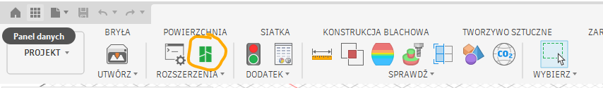

# Autodesk Fusion 360 to Bambu Studio exporter add-in
Adds a button that takes the currently selected solid, exports it to a standard location and then opens it in Bambu Studio.
I had been working a lot with the pair of Fusion 360 and Bambu Studio and got tired of the exporting procedure, where you had to:
1. Go to Tools tab
2. Click the 3d Print button
3. Select solids for export
4. Select directory, then export STL
5. Open Bambu studio
6. Navigate to the location within the load model window
7. Open the exported model

Now it is just one button:

Works on Windows, not sure about other systems.

# Configuration
| Environment variable | Default value | Description| 
|---------|------------|-------------|
| BAMBU_STUDIO_PATH | `C:\\Program Files\\Bambu Studio\\bambu-studio.exe` | Path to bambu-studio executable |
| FUSION_BAMBU_EXPORT_DIR | `C:\\Users\\YOUR_USERNAME\\Documents\\Bambu Studio\\Exports` | Path to where the STL models should be exported to |
| FUSION_BAMBU_CLEAR_EXPORTS_DIR_EACH_USE | `FALSE` | Set to TRUE to make the export dir be cleared each time a new model is exported |

# Installation
1. Download the repo
2. Place it in the directory `C:\Users\Mark\AppData\Roaming\Autodesk\Autodesk Fusion 360\API\AddIns\Bambu`
3. Open Fusion360
4. SHIFT+S
5. Expand the options next to + icon button
6. Script or add-in from the device
7. Select the add-in directory
8. Find the add-in on the list and enable it
9. Find the Bambu icon on the Tools panel